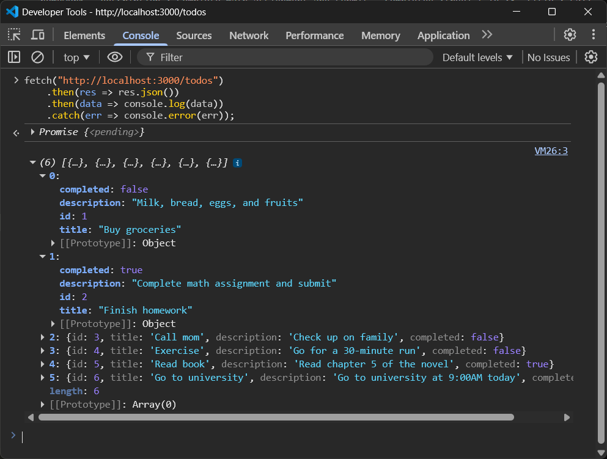
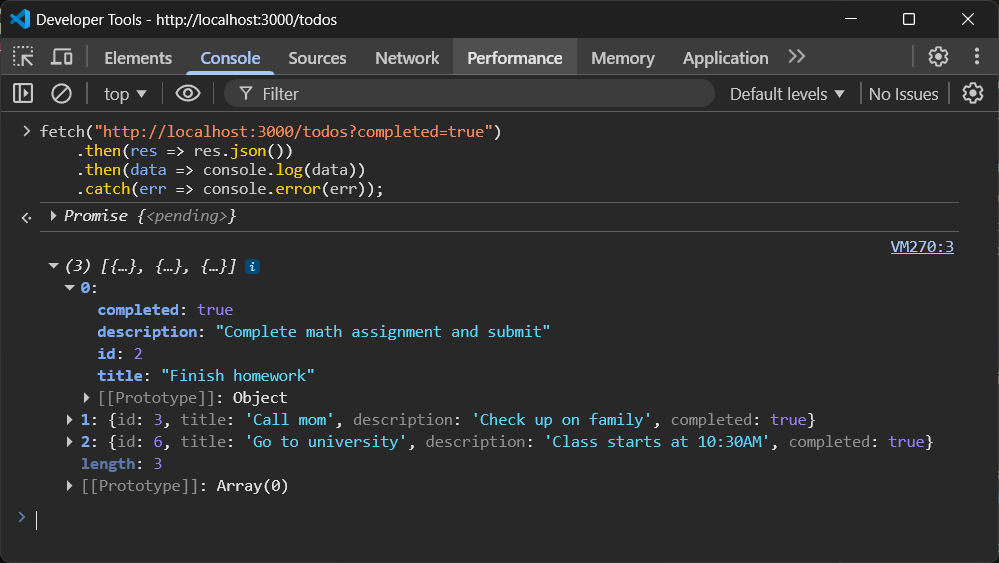
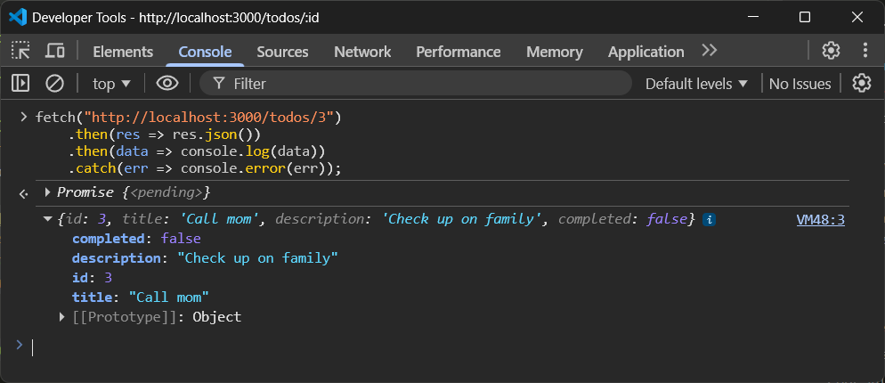
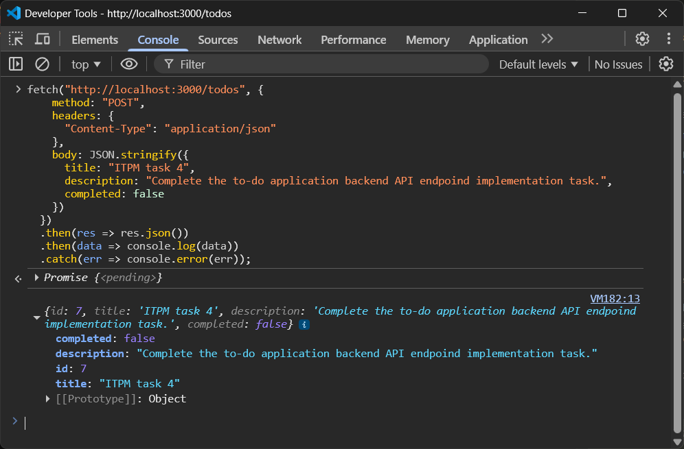
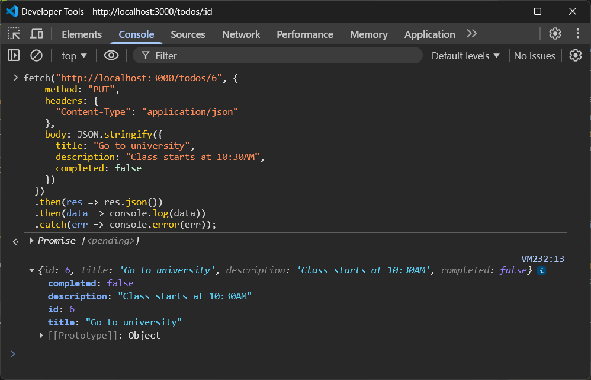
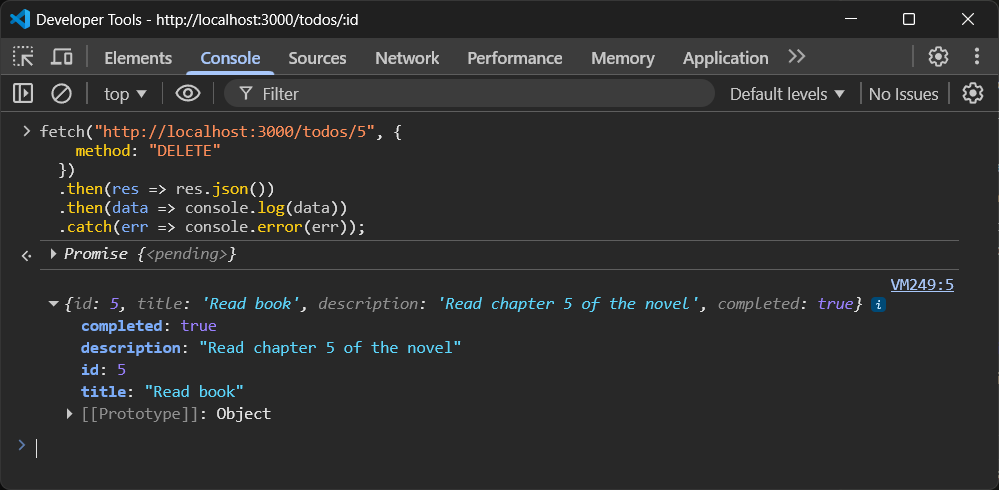

# Todo API Backend

This is the backend for the Todo application, built with Node.js and Express.js. It uses a JSON file for data storage instead of a database.

## Features

- Create, Read, Update, Delete (CRUD) operations for Todos
- Filter todos by completion status
- RESTful API endpoints

## API Endpoints

### Get All Todos
- **GET** `/todos`
- Query parameters: `?completed=true` or `?completed=false` to filter by status
- Testing code for console:
  - Get all todos
    ```js
    fetch("http://localhost:3000/todos")
      .then(res => res.json())
      .then(data => console.log(data))
      .catch(err => console.error(err));
    ```
    Testing Screenshot:
    
  - Get todos by status
    ```js
    fetch("http://localhost:3000/todos?completed=true")
      .then(res => res.json())
      .then(data => console.log(data))
      .catch(err => console.error(err));
    ```
    Testing Screenshot:
    

### Get Single Todo
- **GET** `/todos/:id`
- Testing code for console:
  ```js
  fetch("http://localhost:3000/todos/:id")
    .then(res => res.json())
    .then(data => console.log(data))
    .catch(err => console.error(err));
  ```
- Testing Screenshot:
  

### Create Todo
- **POST** `/todos`
- Body: `{ "title": "string", "description": "string", "completed": boolean }`
- Code to test in console:
  ```js
  fetch("http://localhost:3000/todos", {
    method: "POST",
    headers: {
      "Content-Type": "application/json"
    },
    body: JSON.stringify({
      title: "string",
      description: "description",
      completed: boolean
    })
  })
  .then(res => res.json())
  .then(data => console.log(data))
  .catch(err => console.error(err));
  ```
- Testing Screenshot:
  

### Update Todo
- **PUT** `/todos/:id`
- Body: `{ "title": "string", "description": "string", "completed": boolean }`
- Code to test in console:
  ```js
  fetch("http://localhost:3000/todos/:id", {
    method: "PUT",
    headers: {
      "Content-Type": "application/json"
    },
    body: JSON.stringify({
      title: "string",
      description: "description",
      completed: boolean
    })
  })
  .then(res => res.json())
  .then(data => console.log(data))
  .catch(err => console.error(err));
  ```
- Testing Screenshot:
  

### Delete Todo
- **DELETE** `/todos/:id`
- Code to test in console:
  ```js
  fetch("http://localhost:3000/todos/:id", {
    method: "DELETE"
  })
  .then(res => res.json())
  .then(data => console.log(data))
  .catch(err => console.error(err));
  ```
- Testing Screenshot:
  

## Installation

1. Navigate to the backend directory
2. Run `npm install`
3. Run `npm start`

The server will start on port 3000.